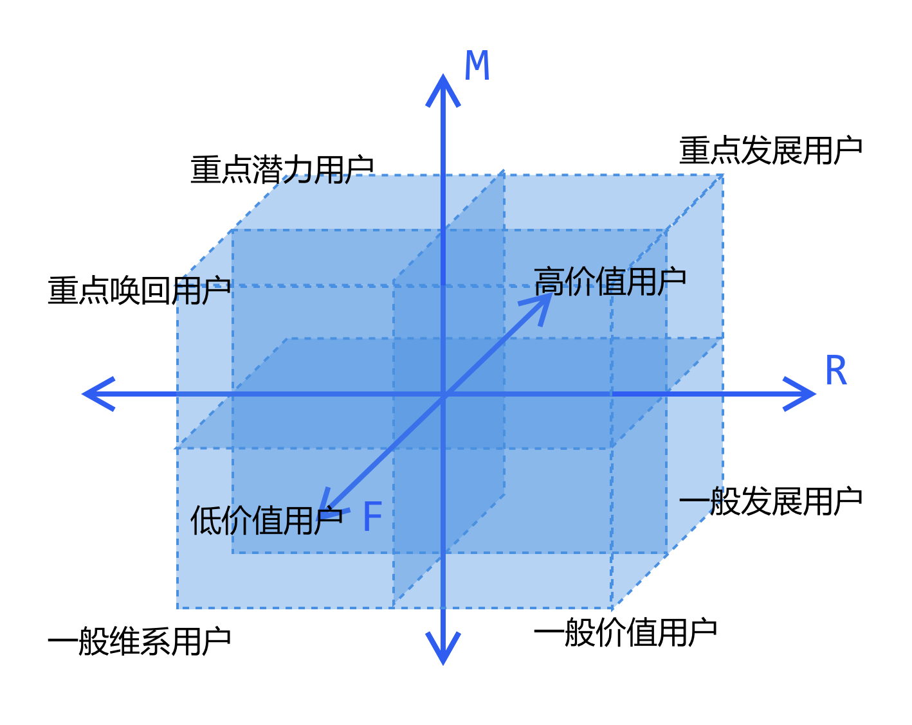
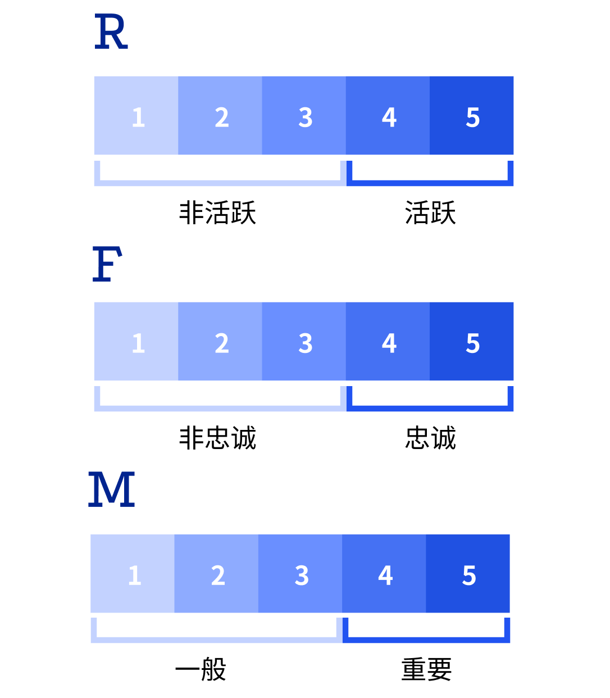
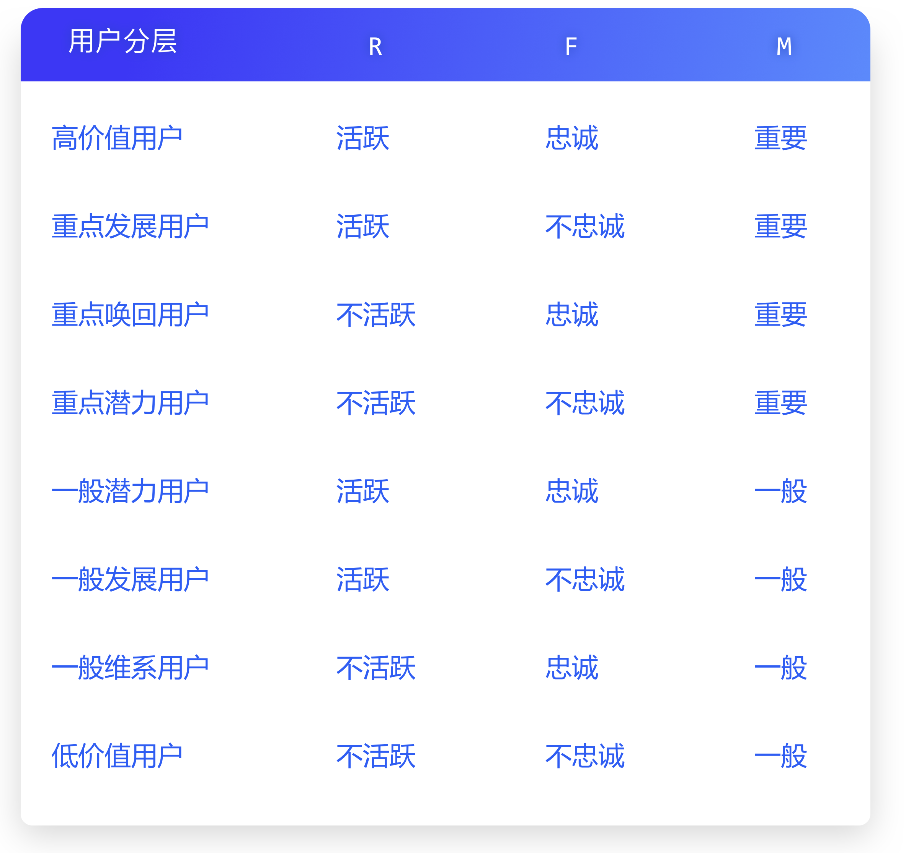
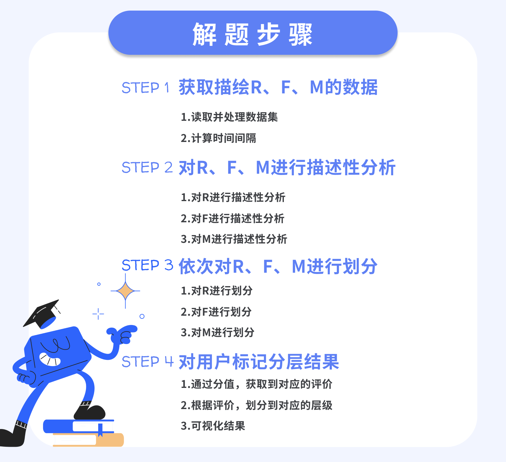

* RFM模型  
R：最近一次消费时间间隔；R值越小，代表活跃度越高  
F：消费频率；F值越大，说明用户的忠诚度就越高  
M：消费金额；M值越大，说明重要度就越高  
把 R、F、M 的价值高低作为坐标轴，那么RFM模型，就是对单个用户，都从这三个维度进行评估，从而将用户定位在这8个象限中，分成8大类型
  
通常情况下，RFM模型采取五分制，即把描述R、F、M指标的数据都分为5个层级，并标记为1-5分  

* 数据分箱
本质就是把数据进行分组，左开右闭  
分箱方式：
1. 指定数值边界
2. 指定频率边界
