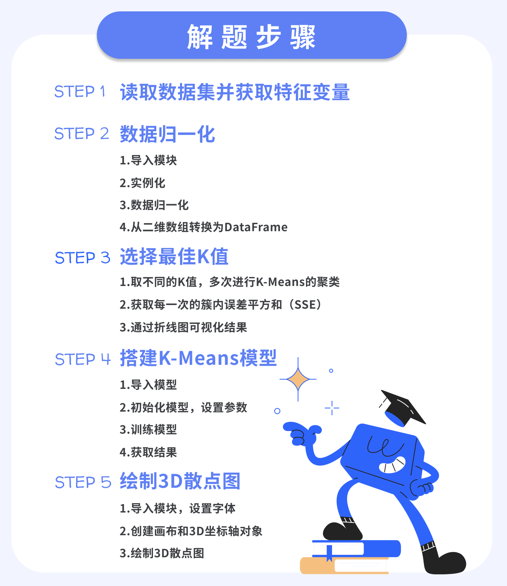

* K-Means是非监督学习中一种很经典的聚类算法。
* K代表类别数量，Means代表每个类别内的均值，所以K-Means算法又称为K-均值算法。
* 该算法会根据数据样本间的相似性，将数据样本自动分为K个簇（cluster），相似的数据样本会尽可能被聚到一个簇内。簇，指的就是类别或是组。
* 选择合适的质心，使得在每个簇内，每个样本与质心之间的距离尽可能小。
* 数据归一化，也称Z-score标准化，通过原始数据的均值（mean）和标准差（standard deviation/std）对数据进行标准化。
* 肘部法则，就是取不同的K值，多次进行K-Means的聚类，并获取每一次的簇内误差平方和（SSE），然后将结果进行绘制。 
* 随着K值增大，质心变多，SSE会随之降低，当下降幅度明显趋向于缓慢的时候，即认为是最佳的K值。  
